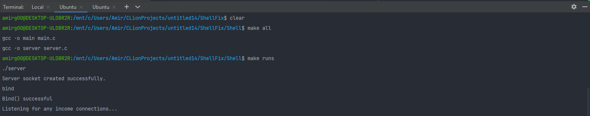
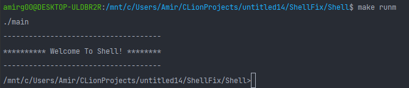

# Introduction:


## Tasks:

Your shell has to support the following commands:

1. ```EXIT``` to exit the shell.


2. Shell has to present the current working directory,
   for instance: ```C:\users\user>```


3. ```ECHO <message>``` which prints message to the standard output.


4. ```TCP PORT``` which opens a TCP connection to Localhost ("127.0.0.1"),
   and the standard output will be copied to server's standard output.


5. ```LOCAL``` which closes any opened socket, and copies the standard output
   back to the client's standard output.


6. ```DIR``` command to present the files list in the current working directory.


7. ```CD <DIRNAME>``` command changes the current working directory to a given 
   directory name that is located within current working directory.


8. Any other command that the shell is unfamiliar with, will be executed by
   system. 


9. The last section's (8) code will be commented, and any other
   command will be executed by fork, exec, and wait commands.

   
10. ```COPY <SRC> <DEST>``` which copies the file appears in SRC
    and copies it to DST.


11. ```DELETE <FILENAME>``` - deletes the file with the given file name, 
    implemented using unlink. 


-----------
##  How To Run
1. Compile files first with ```make all``` in terminal.
2. In terminal run the server with ```make runs``` command.
3. In other terminal run the shell with ```make runm``` command.
4. Now, you are ready to go with a working shell 🙂.

***Example***

As above, we will compile files and run the server.

<p align="center">

</p>

Now, we will run the shell.

<p align="center">

</p>